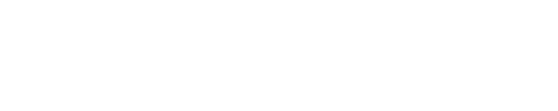
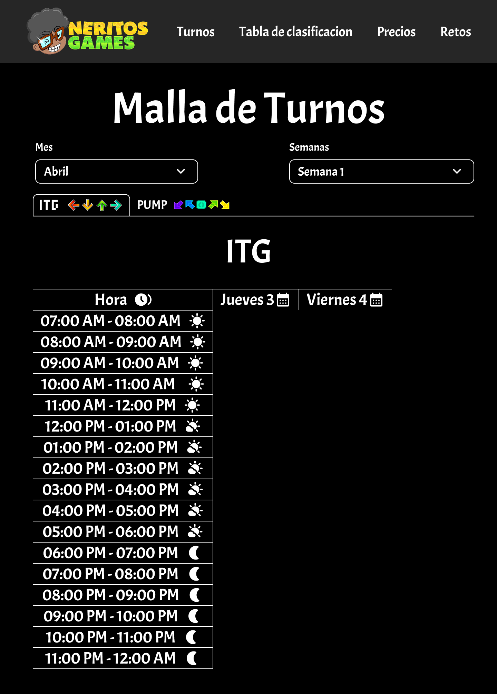
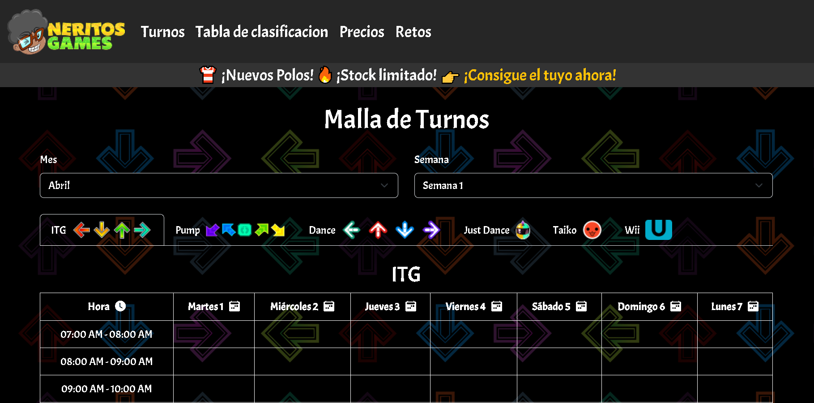
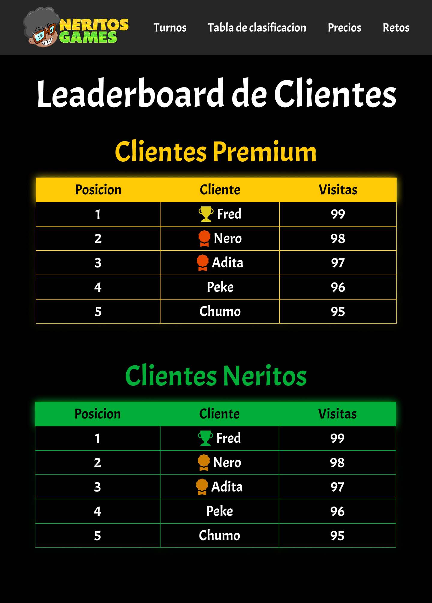
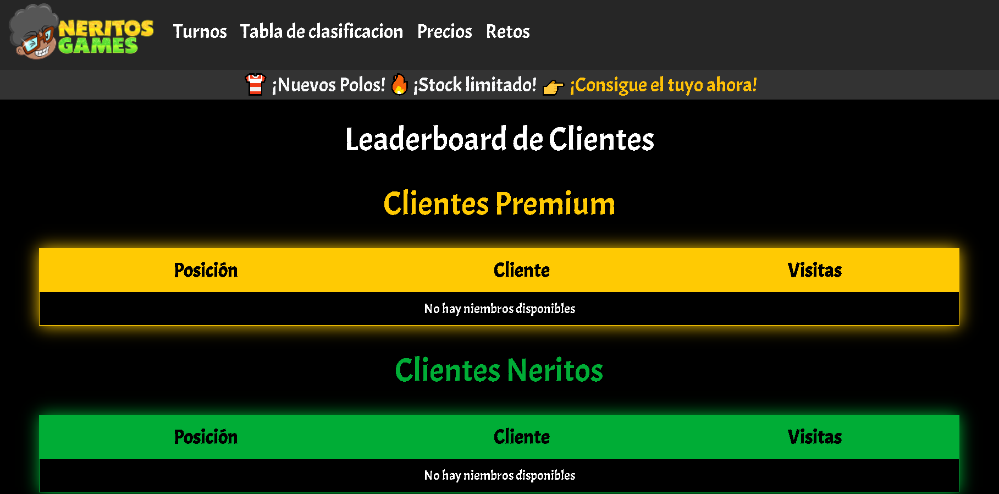
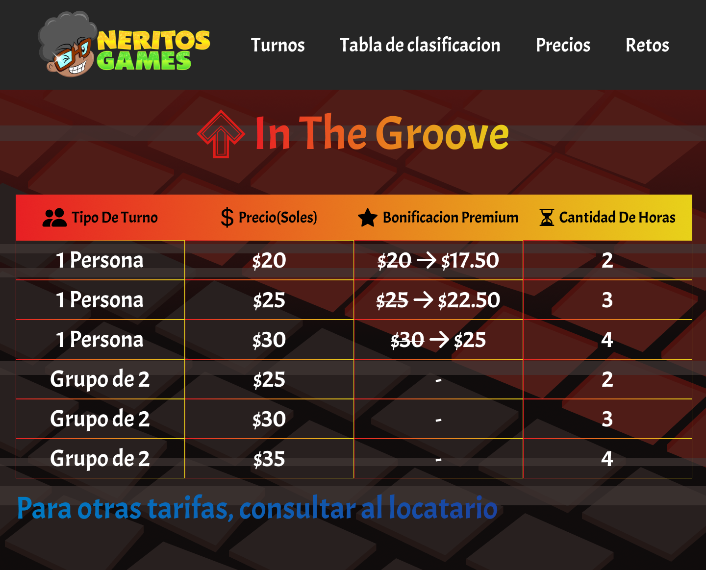
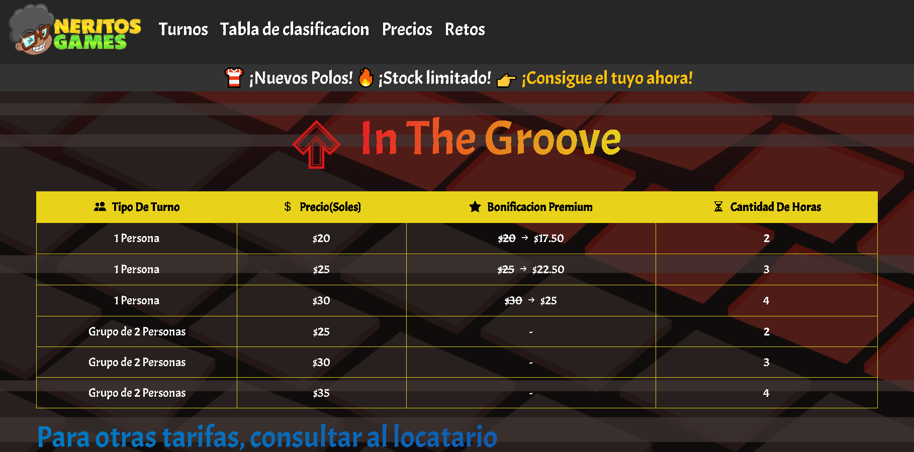
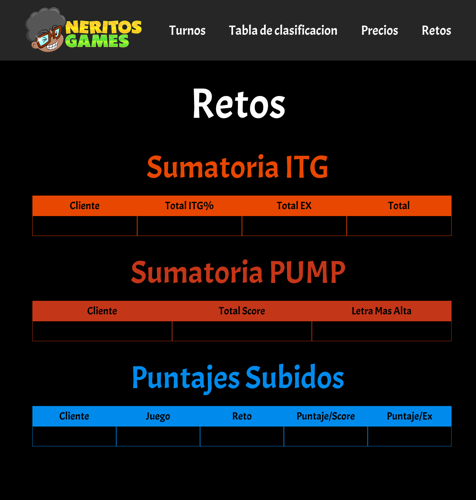
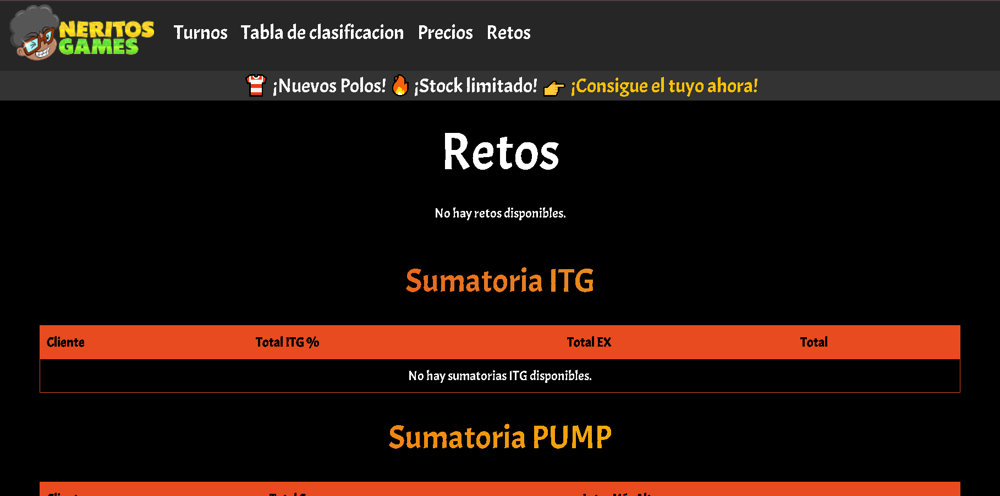

# NeritosGames-Web

## Tabla de Contenidos
- [Descripción](#descripción)
- [Info Rápida](#info-rápida)
- [Características Principales](#características-principales)
- [Tecnologías Utilizadas](#tecnologías-utilizadas)
- [Hoja de Bugs](#hoja-de-bugs)
- [Diseño y Experiencia de Usuario (UI/UX)](#diseño-y-experiencia-de-usuario-uiux)
    -[Galería](#galería)
- [Contacto](#contacto)
- [Licencia y Copyright](#licencia-y-copyright)

# Descripción

🎮 ¡El portal digital oficial de NeritosGames! Descubre eventos, explora nuestro catálogo de juegos, consulta horarios y mantente conectado con nuestra comunidad. Visítanos en [neritosweb.onrender.com](https://neritosweb.onrender.com).

## Info Rápida

* Fecha de Inicio del proyecto: 4 abril
* Fecha de Finalización del proyecto: 25 abril

**Esta tabla ofrece una estimación general del tipo de tareas comunes en el desarrollo y mantenimiento de NeritosGames-Web, basado en un tiempo total de desarrollo aproximado de 504 horas:**
<table>
    <thead>
        <tr>
            <td>Tipo de Acción</td>
            <td>Tiempo Aproximado (h)</td>
            <td>Dificultad</td>
        </tr>
    </thead>
    <tbody>
        <tr>
            <td><strong>Desarrollo Frontend</strong></td>
            <td>10 - 16 h</td>
            <td>Media / Alta</td>
        </tr>
        <tr>
            <td><strong>Desarrollo Backend</strong></td>
            <td>12 - 24 h</td>
            <td>Media / Alta</td>
        </tr>
        <tr>
            <td><strong>Diseño UI/UX</strong></td>
            <td>11 - 30 h</td>
            <td>Media / Alta</td>
        </tr>
        <tr>
            <td><strong>Base de Datos</strong></td>
            <td>1 - 3 h</td>
            <td>Baja / Media</td>
        </tr>
        <tr>
            <td><strong>Configuración / Despliegue</strong></td>
            <td>0.5 - 2 h</td>
            <td>Baja / Media</td>
        </tr>
        <tr>
            <td><strong>Resolución de Bugs</strong></td>
            <td>1 - 8 h</td>
            <td>Variable (Baja a Alta)</td>
        </tr>
        <tr>
            <td><strong>Añadir Características o Rediseñar</strong></td>
            <td>4 - 10 h</td>
            <td>Media / Alta</td>
        </tr>
</table>

> **Nota:** Los tiempos y dificultades son estimaciones del esfuerzo requerido para tareas individuales representativas dentro del proyecto. La complejidad específica de cada tarea puede variar.

## Características Principales
*   📅 Malla de Turnos en Tiempo Real: Consulta los turnos disponibles para juegos como In The Groove, Pump It Up, Dance Dance Revolution, JustDance, Taiko y Wii, con filtros por semanas y meses para planificación a largo plazo.
*   🏆 Tabla de Clasificación de Usuarios: Visualiza el ranking de usuarios basado en su cantidad de visitas, diferenciando entre clientes Neritos y Premium.
*   💵 Precios y Beneficios: Accede a tablas de precios actualizadas para cada tipo de turno, incluyendo los beneficios exclusivos para usuarios Premium en todos los juegos disponibles.
*   🎯 Zona de Retos Semanales: Participa en desafíos de In The Groove y Pump It Up, completa hasta 5 retos por semana y sigue tu progreso en la tabla de clasificación de puntos acumulados.

## Tecnologías Utilizadas

  &nbsp;
  &nbsp;
  &nbsp;
  &nbsp;
  &nbsp;
  &nbsp;
  &nbsp;

## Hoja de Bugs

Ruta de Bugs que surgieron mientras se desarrollaba el proyecto, cada color representa la dificultad (rojo difícil y verde fácil):

**Turnos**
- 🔴 Bug 1: Días y Semanas en inglés
- 🟢 Bug 2: Horas disponibles rotas de horario nocturno
- 🟢 Bug 3: Selects Días y Semanas intercalados (semanas y meses desordenados o textos rotos)
- 🟢 Bug 4: Pestañas intercambiables rotas para la malla de turnos
- 🟢 Bug 5: Fondo de pestaña no aparece o no intercala
- 🔴 Bug 6: Turnos no correctos o fuera del rango

**Tabla de clasificación de usuarios**

- 🔴 Bug 1: No hay resultados disponibles aún cuando en la base de datos sí existen datos
- 🟢 Bug 2: Los usuarios no están ordenados
- 🟢 Bug 3: Iconos rotos

**Precios y Beneficios**

- 🟢 Bug 1: Fondo no cambiante entre tablas
- 🔴 Bug 2: Imágenes y svgs rotos
- 🟢 Bug 3: Footer con display más pequeño de lo esperado
- 🟢 Bug 4: Cards no responsive

**Retos**

- 🟢 Bug 1: Cards rotas
- 🔴 Bug 2: Sumatoria ITG no funcional (Cálculo no correcto entre Total x y Total y)
- 🟢 Bug 3: Orden de usuarios mal hecho
- 🟢 Bug 4: Iconos rotos
- 🔴 Bug 5: Sumatoria Pump no funcional (Cálculo no correcto entre Total x y Total custom)
- 🟢 Bug 6: Puntajes subidos no correctos

## Diseño y Experiencia de Usuario (UI/UX)

Un vistazo rápido de lo que se realizó en el diseño:

**Principios Clave:**
*  **Usabilidad:** Facilitar el acceso rápido a la información esencial (turnos, precios, rankings, retos).
*  **Consistencia Visual:**
    - Colores Principales:

    
    - Colores Extras:

    
    - Tipografías:

    

*  **Claridad:** Presentar datos complejos de forma clara y organizada.
*  **Idea:** Crear una experiencia atractiva para la comunidad de jugadores de NeritosGames

Si deseas ver más sobre el diseño de [Figma](https://www.figma.com/design/vYvRShmTRz8eYPV27I3c34/Neritos-Desing?node-id=0-1&t=3mvxmGVQeJvsqJ0z-1)

## Galería

Vistazo del antes y después del diseño del proyecto una vez se terminó su desarrollo

**Turnos**
Antes:

Despues:

**Tabla de clasificación de clientes**
Antes:

Despues:

**Precios y Beneficios**
Antes:

Despues:

**Retos**
Antes:

Despues:

**Turnos-Admin**
Antes:

Despues:

**Clientes-Admin**
Antes:

Despues:

**Retos-Admin**
Antes:

Despues:

## Contacto

* Mira mis otros trabajos en GitHub: [SoulSliferts](https://github.com/SoulSliferts)

* Para preguntas o colaboraciones, puedes enviar un correo a: [shadowjli777@gmail.com](mailto:shadowjli777@gmail.com)

* Para reportar errores o sugerir nuevas características, por favor abre un [Issue](https://github.com/SoulSliferts/NeritosGames-Web/issues) en este repositorio.

## Licencia y Copyright

**Copyright del Código Fuente:** © 2025 SoulSliferts

**Derechos del Producto Final:** NeritosGames

**Aviso Importante:**

Aunque el código fuente base fue creado por mí, **todos los derechos relacionados con el producto final, incluyendo (pero no limitado a) el diseño específico, la marca "NeritosGames", el contenido, los datos y la implementación desplegada en neritosweb.onrender.com, pertenecen exclusivamente a NeritosGames.**

**Queda estrictamente prohibido:**

*   Copiar, modificar o distribuir este diseño con el fin de replicar, competir o suplantar el servicio o la marca de NeritosGames.
*   Utilizar elementos visuales, estructurales o funcionales específicos de este proyecto de manera que infrinjan los derechos de NeritosGames.

Cualquier uso del código o diseño que vaya más allá de la simple visualización con fines educativos o de evaluación del desarrollador **requiere el permiso explícito y por escrito tanto de SoulSliferts (para el código base) como de NeritosGames (para cualquier aspecto relacionado con su marca o producto)**

**Todos los derechos reservados**